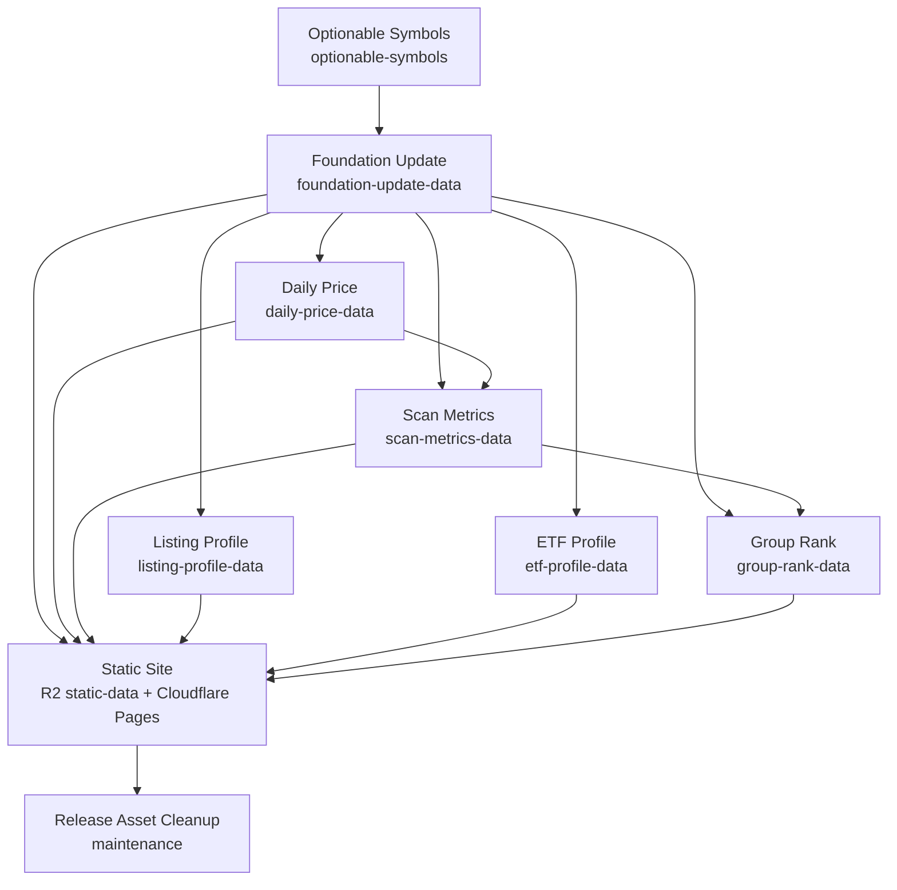
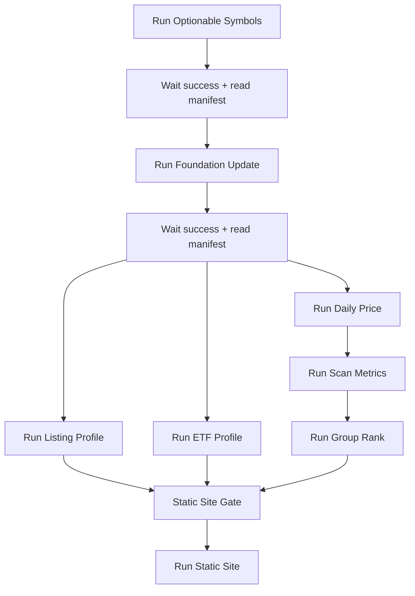
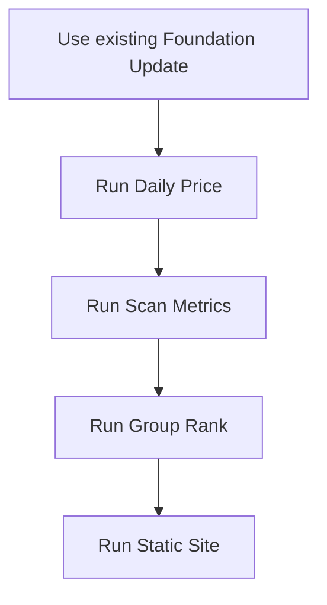

# US Optionable Static Pipeline — Workflow Dependency Plan

## 結論

目前初版資料已可用；下一步不應把排程分散在各個 component workflow，而應整理成 **artifact-native DAG + 少數 orchestrator 入口**：

1. **所有 component workflows 只負責產生/驗證單一 release artifact**。
2. **排程只放在 orchestrator**，不要放在各 component workflow。
3. **長時間資料工作 `cancel-in-progress: false`**，避免 schedule/hourly run 取消 manual repair。
4. **Static Site 只能組 artifact**，不得呼叫 provider、DB、scanner。
5. **Static Site 發布前應使用同一批已驗證 artifact manifest**，避免讀到不同時間點的 latest release 造成 race condition。

---

## 目標 DAG



### 必要依賴

| 下游 | 必要上游 | 原因 |
|---|---|---|
| Foundation Update | Optionable Symbols | foundation universe 必須等於 US optionable universe |
| Daily Price | Foundation Update | 以 foundation symbols 抓 OHLCV |
| Scan Metrics | Foundation Update + Daily Price | 技術/RS/ADR/Setup metrics 需 identity + price history |
| Listing Profile | Foundation Update | IPO/listing/fundamental profile 以 universe 為輸入 |
| ETF Profile | Foundation Update | ETF AUM/profile 以 ETF subset 為輸入 |
| Group Rank | Foundation Update + Scan Metrics | group score/rank 需 industry + symbol score |
| Static Site | Foundation + Daily + Scan + Profiles + Group | 只組 artifact；不自行補資料 |

---

## Component workflows 職責邊界

### 1. `optionable-symbols.yml`

**產物：** `optionable-symbols`

- `optionable-symbols-latest-us.json`
- `optionable-symbols-us-*.json`
- diagnostics on failure

**上游：** NasdaqTrader + Schwab `/chains` provider。

**下游：** `foundation-update.yml`。

**建議：**

- 保留 `workflow_dispatch`。
- 排程不要直接放在此 workflow；由 orchestrator 決定是否要跑 universe refresh。
- `concurrency.group: schwab-token-refresh` / `cancel-in-progress: false` 保留。
- Manual repair 用 inputs：
  - `retry_errors_from_latest`
  - `max_retry_rounds`
  - `max_symbols` for smoke only

---

### 2. `foundation-update.yml`

**產物：** `foundation-update-data`

- `foundation-update-latest-us.json`
- `foundation-update-us-*.json.gz`

**上游：** `optionable-symbols` latest。

**下游：** Daily Price、Scan Metrics、Listing Profile、ETF Profile、Group Rank、Static Site。

**現況亮點：** 已分段：

```text
prepare → build-etf + build-stock → merge-publish
```

**建議：**

- 保留 component workflow 的 manual dispatch。
- 不放 schedule。
- `cancel-in-progress: false` 保留。
- Manifest 必須持續輸出：
  - `sha256`
  - `bundle_asset_name`
  - `symbol_count`
  - `coverage.universe_mode = US_OPTIONABLE`
  - `coverage.missing_active_symbols = 0`

---

### 3. `daily-price.yml`

**產物：** `daily-price-data`

- `daily-price-latest-us.json`
- `daily-price-us-*.json.gz`

**上游：** `foundation-update-data`。

**下游：** `scan-metrics.yml`、`static-site.yml`。

**建議：**

- 日常更新應由 daily orchestrator 觸發。
- `--fetch-mode missing` 可保留，降低 rerun 成本。
- `cancel-in-progress: false` 保留，避免 manual repair 被取消。
- 可加入更嚴格的 manifest pin：記錄使用的 foundation manifest/bundle sha。

---

### 4. `scan-metrics.yml`

**產物：** `scan-metrics-data`

- `scan-metrics-latest-us.json`
- `scan-metrics-us-*.json.gz`

**上游：** Foundation Update + Daily Price。

**下游：** Group Rank + Static Site。

**建議：**

- 只在 Daily Price 成功後跑。
- `cancel-in-progress: false` 保留。
- Manifest 應記錄：
  - foundation sha
  - daily price sha
  - symbol coverage
  - critical field coverage: RS、ADR、rating、setup metrics。

---

### 5. `group-rank.yml`

**產物：** `group-rank-data`

- `group-rank-latest-us.json`
- `group-rank-us-*.json.gz`

**上游：** Foundation Update + Scan Metrics。

**下游：** Static Site。

**建議：**

- 應在 Scan Metrics 成功後跑。
- group rank 是 surrogate rank，不是 official IBD rank；文件與 manifest notes 應保持清楚。
- `cancel-in-progress: false` 保留。

---

### 6. `listing-profile.yml`

**產物：** `listing-profile-data`

- `listing-profile-latest-us.json`
- `listing-profile-us-*.json.gz`

**上游：** Foundation Update。

**下游：** Static Site。

**建議：**

- 可與 Daily Price、ETF Profile 平行。
- 使用 prior profile 加速 repair。
- `cancel-in-progress: false` 保留。

---

### 7. `etf-profile.yml`

**產物：** `etf-profile-data`

- `etf-profile-latest-us.json`
- `etf-profile-us-*.json.gz`

**上游：** Foundation Update。

**下游：** Static Site。

**建議：**

- 可與 Daily Price、Listing Profile 平行。
- 後續補 Schwab `fundamental.totalAssets` fallback 後，應提高 AUM coverage gate。
- `cancel-in-progress: false` 保留。

---

### 8. `static-site.yml`

**產物：**

- `frontend/public/static-data` → R2 `static-data/`
- Cloudflare Pages deployment

**上游：** Foundation + Daily + Scan + Group + Listing + ETF。

**建議改為：**

- Static Site 在 full/daily orchestrator 中最後執行。
- Component workflow 仍可 manual dispatch 做 UI-only redeploy。
- Production deploy 時，Daily Price、Scan Metrics、Group Rank、Listing Profile、ETF Profile 應由 orchestrator 判定為 required；不應默默降級為 optional。
- 若保留 optional 模式，應只用於 emergency preview，不用於 canonical production deploy。

---

## 建議 orchestrator 設計

### A. `static-pipeline-full.yml` — 全量刷新

用途：optionable universe 或 foundation 需要刷新時。



**特性：**

- 手動觸發為主；未來可放低頻 schedule。
- 只在 component workflow success 後繼續。
- 每一步讀取 latest manifest 並保存到 orchestrator summary。
- 失敗時停止，不自動 deploy stale static site。

### B. `static-pipeline-daily.yml` — 日常價格/掃描刷新

用途：美股收盤後日常刷新，不重建 universe/foundation。



**可選平行：**

- Listing Profile / ETF Profile 通常不用每天跑。
- 若 profile workflow 在前一日失敗，可 manual repair 後只 rerun Static Site。

### C. `static-pipeline-repair.yml` — 修復指定 layer

用途：修某個 artifact，不跑整條 pipeline。

建議 inputs：

```text
repair_layer:
  optionable
  foundation
  daily-price
  scan-metrics
  group-rank
  listing-profile
  etf-profile
  static-site-only
```

規則：

- 修上游時，自動跑必要下游。
- 修 supplemental profile 時，只需跑該 profile + Static Site。
- `static-site-only` 僅重新組既有 artifact + deploy。

---

## 自動執行時間

GitHub Actions cron 只支援 UTC，且不支援 timezone / DST；因此 production orchestrators 採用 **hourly wake + job 內用 `TZ=America/New_York` gate**，確保實際時間符合美東時間。

| Workflow | 自動執行時間 | 實際用途 |
|---|---|---|
| `static-pipeline-full.yml` | 每二週 Sunday 20:00 America/New_York | Full refresh：optionable → foundation → prices/metrics/profiles → static site |
| `static-pipeline-daily.yml` | Monday-Friday 08:00 and 18:00 America/New_York | Daily refresh：daily price → scan metrics → group rank → static site；開盤前與收盤後各更新一次 |
| `release-asset-cleanup.yml` | Monday 03:00 America/New_York | Weekly release artifact cleanup，避開 full refresh window |
| Component workflows | 無 production schedule；manual only | 由 orchestrators 觸發，或人工 repair |
| `static-pipeline-repair.yml` | 無 schedule；manual only | 指定 layer 修復 |
| `static-site.yml` | 無 schedule；manual/orchestrator only | Production pinned deploy 或 preview redeploy |

---

## 推薦執行模式

### Full refresh

```text
optionable-symbols
→ foundation-update
→ daily-price + listing-profile + etf-profile
→ scan-metrics
→ group-rank
→ static-site
```

### Daily refresh

```text
daily-price
→ scan-metrics
→ group-rank
→ static-site
```

### Profile repair

```text
listing-profile or etf-profile or group-rank
→ static-site
```

### UI-only deploy

```text
static-site
```

---

## Concurrency 原則

| Workflow 類型 | cancel-in-progress | 原則 |
|---|---:|---|
| Long data build | `false` | manual repair 不可被 schedule 或下一次 run 取消 |
| Schwab token refresh | `false` | token rotation 不可中斷 |
| Orchestrator | `false` | 全鏈路不可半途被下一輪取消 |
| Static Site deploy | 建議 production orchestrator 用 `false`；UI preview 可 `true` | 避免 deploy 被新 run 中斷；UI-only 可允許新版本取代舊版本 |
| CI | `true` | push/PR 快速迭代可取消舊 run |
| Cleanup | `false` | 避免 release asset 刪除半途互相干擾 |

---

## Artifact contract 建議

每個 manifest 應至少包含：

```json
{
  "schema_version": "...",
  "market": "US",
  "as_of_date": "YYYY-MM-DD",
  "generated_at": "ISO-8601",
  "bundle_asset_name": "...json.gz",
  "sha256": "...",
  "symbol_count": 5619,
  "symbol_coverage": 1.0,
  "upstreams": {
    "foundation_update": {
      "manifest_asset": "foundation-update-latest-us.json",
      "bundle_asset_name": "foundation-update-us-...json.gz",
      "sha256": "..."
    }
  },
  "field_coverage": {}
}
```

Static Site manifest 應記錄完整 input set：

```json
{
  "inputs": {
    "foundation_update_sha256": "...",
    "daily_price_sha256": "...",
    "scan_metrics_sha256": "...",
    "group_rank_sha256": "...",
    "listing_profile_sha256": "...",
    "etf_profile_sha256": "..."
  }
}
```

---

## Production gates

### Hard gates

- `optionable-symbols`: errors = 0；optionable count >= 3000。
- `foundation-update`: symbol coverage >= 0.98；missing active symbols = 0。
- `daily-price`: symbol coverage >= 0.80；price bundle sha match。
- `scan-metrics`: symbol coverage >= 0.80；RS/ADR/rating/setup critical fields >= 0.80。
- `static-site`: rows_total >= 3000；price/sparkline coverage >= 0.80。

### Soft gates / warning only

- ETF AUM coverage before Schwab `totalAssets` fallback。
- IPO date coverage。
- EPS/Sales coverage。
- Themes coverage until `themes-data` exists。

---

## Legacy / non-core workflows

| Workflow | 建議定位 |
|---|---|
| `ci.yml` | 保留；與 static artifact DAG 獨立 |
| `release-asset-cleanup.yml` | 保留；改成支援所有新 release artifacts 後再恢復 schedule |
| `ibd-classification.yml` | 目前仍含 DB/Postgres、多市場、workflow_run；不應作為 US static pipeline 依賴。後續若要恢復，應 artifact-native 化或明確改為非 production supplemental。 |
| `cn-daily-price-bootstrap.yml` | CN legacy/bootstrap，與 US optionable static pipeline 分離 |
| `weekly-reference-data.yml` | 若檔案已移除，應清乾淨所有 fallback 與 cleanup policy；若仍需 legacy fallback，文件需明確標註 deprecated |

---

## 落地順序建議

1. **先新增 orchestrator workflows**：`static-pipeline-full.yml`、`static-pipeline-daily.yml`、必要時 `static-pipeline-repair.yml`。
2. **移除 component workflow 的 production schedule**，只保留 `workflow_dispatch`。
3. **把 Static Site optional inputs 改成 production required gate**，preview/emergency 模式另開 input。
4. **在所有 downstream manifest 加 upstream sha 記錄**，避免 latest race condition。
5. **更新 cleanup policy**，納入：
   - `optionable-symbols`
   - `scan-metrics-data`
   - `group-rank-data`
   - `listing-profile-data`
   - `etf-profile-data`
6. **處理 legacy fallback**：逐步移除 `weekly-reference-data` fallback，避免新舊資料契約混用。
7. **再恢復 schedule**：只恢復 orchestrator schedule，不恢復 component schedule。

---

## 已確認決策

1. **Full refresh cadence：每二週。**
   - 用於刷新 optionable universe、foundation、daily price、scan metrics、profiles、group rank、static site。
   - 排程只放在 full orchestrator，不放在 component workflows。

2. **Daily refresh cadence：美股開盤前與收盤後。**
   - Monday-Friday 08:00 America/New_York：開盤前刷新，保留約 90 分鐘緩衝，確保 09:30 開盤前完成。
   - Monday-Friday 18:00 America/New_York：收盤後刷新，比原 20:00 ET 提早 2 小時。
   - 用於日常刷新 daily price、scan metrics、group rank、static site。
   - 不重建 optionable universe / foundation / listing profile / ETF profile，除非人工修復或 full refresh。

3. **Static Site production 不允許 optional artifact 缺失。**
   - Production deploy 必須具備：
     - `foundation-update-data`
     - `daily-price-data`
     - `scan-metrics-data`
     - `group-rank-data`
     - `listing-profile-data`
     - `etf-profile-data`
   - 若要允許缺失，只能透過明確的 emergency / preview mode，不作為 canonical production deploy。

4. **`ibd-classification.yml` 保留為非 core experimental workflow。**
   - 不納入 US optionable static production DAG。
   - 保留 manual / experimental 用途。
   - 後續若要升級成 production supplemental，需先 artifact-native 化並移除 DB/Postgres 依賴。

5. **建立 `pipeline-run-manifest` release。**
   - 每次 orchestrator run 都保存完整 input/output artifact set。
   - 用於追蹤同一批 deployment 使用的 manifests、bundle asset names、sha256、workflow run ids。
   - Static Site production deploy 應以 pipeline run manifest pin 住 artifact set，避免 latest release race condition。

---

## 已落地 workflow 實作

1. **`pipeline-run-manifest` release contract**
   - Orchestrators 會建立/更新 `pipeline-run-manifest` release。
   - 每次 run 會發布：
     - `pipeline-run-full-YYYYMMDD-<run_id>.json`
     - `pipeline-run-daily-YYYYMMDD-<run_id>.json`
     - `pipeline-run-repair-YYYYMMDD-<run_id>.json`
     - `pipeline-run-latest-us.json`
   - Manifest 內容包含 component run ids、required artifacts、release names、manifest asset names、bundle asset names、sha256、coverage summary。

2. **`static-pipeline-full.yml`**
   - 每二週 full refresh。
   - GitHub cron hourly wake；job 內 gate 到每二週 Sunday 20:00 America/New_York。
   - 執行：
     ```text
     optionable-symbols
     → foundation-update
     → daily-price
     → listing-profile
     → etf-profile
     → scan-metrics
     → group-rank
     → pipeline-run-manifest
     → static-site production pinned deploy
     ```

3. **`static-pipeline-daily.yml`**
   - 美股開盤前與收盤後 daily refresh。
   - GitHub cron hourly wake；job 內 gate 到 Monday-Friday 08:00 and 18:00 America/New_York。
   - 執行：
     ```text
     daily-price
     → scan-metrics
     → group-rank
     → pipeline-run-manifest
     → static-site production pinned deploy
     ```

4. **`static-pipeline-repair.yml`**
   - 支援指定 layer 修復：
     ```text
     optionable / foundation / daily-price / scan-metrics /
     group-rank / listing-profile / etf-profile / static-site-only
     ```
   - 修上游時自動跑必要下游。
   - 修 supplemental profile 時只跑該 profile + pinned Static Site deploy。

5. **`static-site.yml` production required gate**
   - 新增 `deployment_mode`：`production` / `preview`。
   - `production` 必須具備完整 artifact：
     - foundation update
     - daily price
     - scan metrics
     - group rank
     - listing profile
     - ETF profile
   - 新增 `pipeline_manifest_asset` input；production orchestrators 會用 pinned manifest deploy，避免 latest race condition。
   - `preview` 才允許 non-core artifacts 缺失。

6. **Release cleanup policy 已更新**
   - 納入：
     - `optionable-symbols`
     - `scan-metrics-data`
     - `group-rank-data`
     - `listing-profile-data`
     - `etf-profile-data`
     - `pipeline-run-manifest`
   - 保留最新 manifest 參照的 bundle，不刪 active latest。

7. **Downstream upstream sha 記錄**
   - 目前由 `pipeline-run-manifest` 統一記錄每次 deployment 使用的 artifact set 與 sha。
   - 各 component manifest 仍可後續補上自身 upstream sha，但 production deploy 已先由 pipeline-run manifest 達成 pinning 與追溯。
